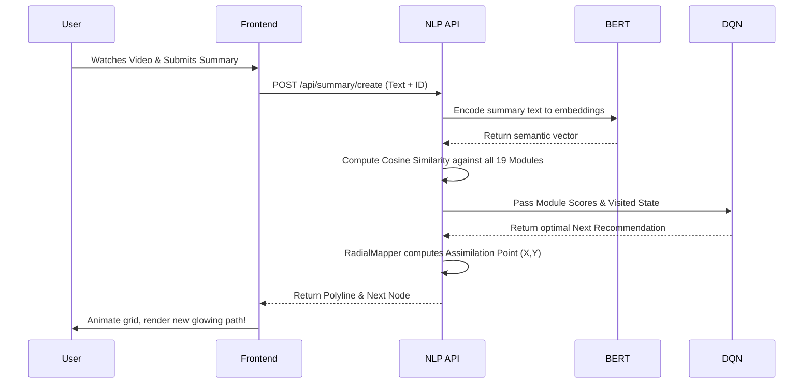

# Navigated Learning Platform 🚀


Welcome to the **Navigated Learning Platform** — a next-generation, AI-driven educational operating system. This platform transforms linear, boring curriculum into an interactive 2D spatial learning grid ("The Neural Matrix"). By leveraging Reinforcement Learning (DQN) and Semantic Analysis (BERT), the system creates dynamic, deeply personalized learning paths (Polylines) tailored perfectly to each student's evolving comprehension.

---

## 🌟 Core Philosophy

Instead of a traditional list of courses, topics are mapped onto a **2D Coordinate Grid** based on conceptual similarity.
When a student interacts with materials and writes summaries, the system:
1. **Analyzes** their comprehension using BERT sentence embeddings.
2. **Maps** their knowledge trajectory as an active, glowing "Polyline".
3. **Recommends** their next optimal learning node using a Deep Q-Network (DQN) trained on historical student paths.
4. **Visualizes** their assimilation by plotting an aggregated point (The Center of Gravity) showing exactly where their knowledge sits conceptually.

---

## 🏗️ System Architecture

The architecture relies on a synergy between an interactive React frontend and a heavyweight Python/Flask AI backend.

```mermaid
graph TD
    subgraph Frontend [React / Vite Client]
        UI[User Interface] -->|Login / Auth| ID[Student ID Auth Flow]
        UI -->|Grid Exploration| GV[Grid Visualization]
        UI -->|Node Interation| MM[Media & Modules]
        UI -->|Knowledge Check| SM[Summary Submission]
    end

    subgraph API [Flask REST API]
        R[Router]
        R --> EP1[/api/resources]
        R --> EP2[/api/summary/create]
        R --> EP3[/api/agent]
    end

    subgraph Core AI Systems [Python Backend]
        BERT[BERT NLP Pipeline]
        DQN[Deep Q-Network Model]
        RM[Radial Mapper Engine]
    end

    subgraph Data Layer [Persistence]
        CSV[topic_2d_coordinates.csv]
        JSON[nlp_resources.json]
        DB[(JSON File DB)]
    end

    UI <--> R
    EP1 --> JSON
    EP1 --> CSV
    EP2 --> BERT
    EP2 --> DQN
    EP2 --> RM
    BERT --> DB
    RM --> DB
    DQN --> DB
```

---

## 🧠 The Neural Matrix & Polyline Engine

### 1. Spatial Grid Generation
Topics are assigned hard coordinates using the master file `topic_2d_coordinates.csv`. The backend scales these 0.0-1.0 floats perfectly onto the frontend's spatial grid. 

### 2. The Assimilation Loop
When a user completes a module and submits a summary, the **Assimilation Loop** triggers:



---

## ⚡ Key Modules

### The Navigator Dashboard
The launchpad for students. Displays the active "Advances in NLP" map, their accumulated XP, their current level (S1, S2, etc.), and their uniquely calculated **Educational Persona**.

### The Grid Visualization
The interactive 2D map. 
- **Nodes**: Educational content (Videos, Texts, Quizzes) placed according to the CSV.
- **Paths**: The current user's learning path, combined with the "Average Knowledge" paths of past sessions.
- **The "High Line"**: A visual representation of peak potential — the optimal path a mastery-level student would take.

### AI Persona Synthesis
As the user completes content, the system derives an Educational Persona (e.g., "The Synthesizer", "The Pragmatist") based on the semantic density of their summaries, directly impacting UI colors and prompts.

---

## 🔧 Getting Started

### Prerequisites
- Node.js (v18+)
- Python (3.9+)

### 1. Start the Backend (Flask / AI Models)
```bash
cd backend
python -m venv venv
source venv/bin/activate  # On Windows: .\venv\Scripts\activate
pip install -r requirements.txt
python app.py
```
*(Note: The first run will automatically download the required NLTK datasets and HuggingFace `all-MiniLM-L6-v2` BERT models. This may take a minute).*

### 2. Start the Frontend (React)
```bash
# In a new terminal
npm install
npm run dev
```

### 3. Enter the Matrix
Open your browser to `http://localhost:5173`. 
Create a new student account using the ID Badge auth flow, click **Enter the Navigator**, and begin traversing the grid!

---

## 📝 A Note on Coordinate Shifting
Previously, the Grid used an integer rounding and collision-nudging algorithm which caused topics to shift slightly depending on load order. **This has been completely overhauled.** The system now streams exact floating-point metrics (`mapped_x`, `mapped_y`) from `topic_2d_coordinates.csv`, ensuring hyper-accurate, deterministic spatial placement across all sessions. 

---

*Engineered for the future of interactive learning.*
